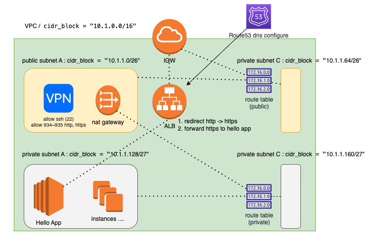

### Endpoint configure 

1. dns 세팅.
2. vpc 구성 
3. VPN 설정
4. Application 서버는 image 미리 만든거 가져옴
5. route 53 의 경우 tf 설정이 어려워서 콘솔로 만들고 그냥 추후에 alb 에 달 예정.
6. 전반적인 plan, apply 의 속도가 너무느림 (최소 20분,  잘못된거 고쳐야함.)

7. 구성.

